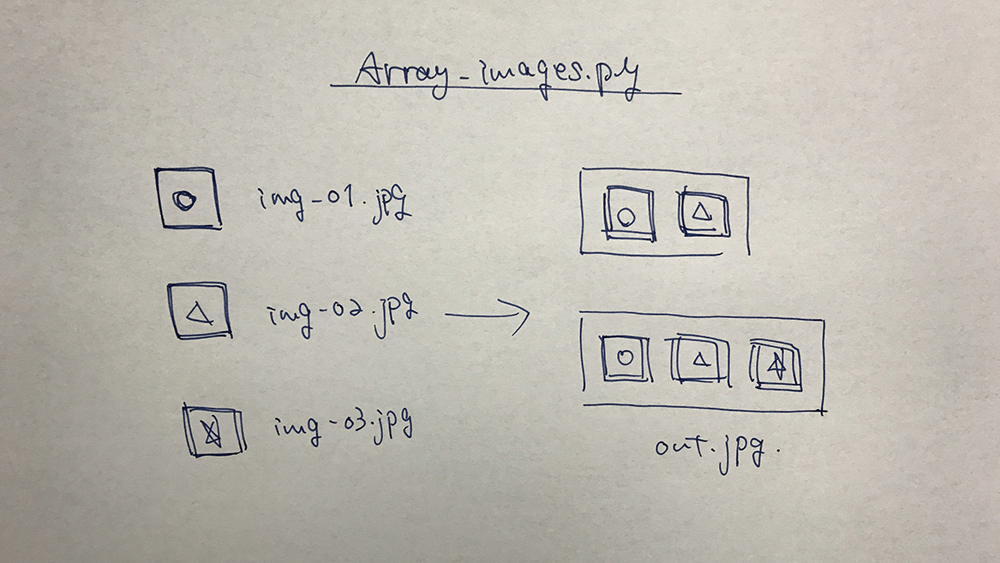
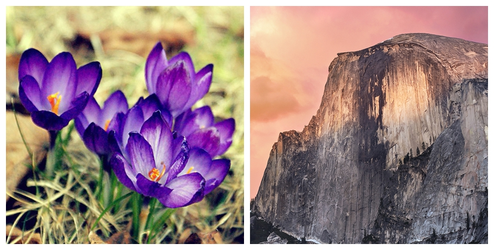
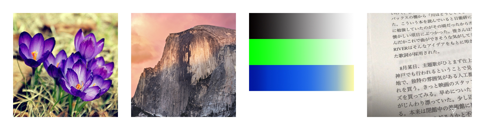
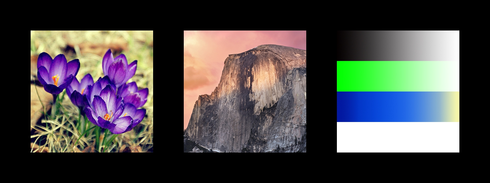

# Array_images  

連番画像を並べて1枚の画像にして返す画像編集ツール。  

ただ画像を並べるだけの時にいちいち Photoshop を使いたくない + 研究室 PC に Adobe がないので地味に困っていた。  
~~レンダリング中暇だったので~~、今後よく使いそうな気がしたので作った。  


  


---  


### How to use  

```
$ python3 Array_images.py A B C D E F
```

コマンドライン引数  
A : img_count (int), 枚数は、1-99 まで対応  
B : file_name (str)  
C : inner_w (int)  
D : inner_h (int)  
E : margin (int)  
F : bgc (int), 0-255  


---


### Examples  

素材は、連番の名前をつけておく。  
cf. name-01.jpg  

白背景  

```
$ python3 Array_images.py 2 ImageSample 400 400 10 255
```



```
$ python3 Array_images.py 4 ImageSample 400 400 50 255
```




黒背景  

```
$ python3 Array_images.py 3 ImageSample 400 400 100 0
```



```
$ python3 Array_images.py 4 ImageSample 400 400 50 0
```


---  


### Memo  

理想は、matplotlib の 複数枚画像のグリッド行列とグリッド位置指定の imshow のようなもの。  

まずは、Processing でやろうとしたけど、コマンドラインツールにならなそうだったので、Pythonで。  
opencv で実装しようかと思っていたけど、PIL でできた。  


---  


### Ref.  


Python, Pillowで画像に別の画像を貼り付けるpaste（note.nkmk.me）  
[https://note.nkmk.me/python-pillow-paste/](https://note.nkmk.me/python-pillow-paste/)  


Python, Pillowで円や四角、直線などの図形を描画（note.nkmk.me）  
[https://note.nkmk.me/python-pillow-imagedraw/](https://note.nkmk.me/python-pillow-imagedraw/)  


Python, Pillowで画像を一括リサイズ（拡大・縮小）（note.nkmk.me）  
[https://note.nkmk.me/python-pillow-image-resize/](https://note.nkmk.me/python-pillow-image-resize/)


OpenCVで画像の上に別な画像を貼り付ける （位置・サイズ指定あり）  
[http://d.hatena.ne.jp/kougaku-navi/20160108/p1](http://d.hatena.ne.jp/kougaku-navi/20160108/p1)